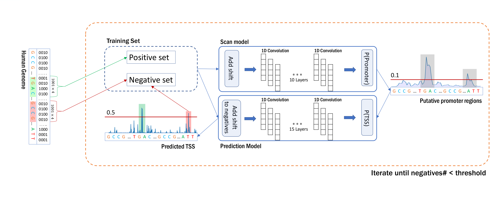

# ReFeaFi: Genome-wide prediction of regulatory elements driving transcription initiation

## Installation

Simply clone this repository and run predict.py to use the pre-trained models. 
ReFeaFi requires ```tensorflow==1.7.0```:
```sh
pip install tensorflow==1.7.0
```
OR
```sh
pip install tensorflow-gpu==1.7.0
```
for the GPU version. In this case you also need to install CUDA9 and cuDNN7. 
## Usage
ReFeaFi can be run from the command line:
```sh
python predict.py -I hg19.fa -O human_regulatory_regions.gff
```
Required parameters:
 - ```-I```: Input fasta file.
 - ```-O```: Output gff file.

Optional parameters:
 - ```-D```: Minimum soft distance between the predicted TSS, defaults to 1000.
 - ```-C```: Comma separated list of chromosomes to use for promoter prediction, defaults to all.
 - ```-T```: Decision threshold for the prediction model, defaults to 0.5.
 
The predictions for the 6 species from the study can be downloaded directly from [predictions.zip](https://drive.google.com/file/d/1OPilSt1-VDSWU71T8gXsWexk6qIVLfYU/view?usp=sharing) 
 
To calculate dependency score used for the pair maps, run dependency_score.py:
```sh
python dependency_score.py promoters.fa 495:505 460:475 
```
Where first parameter is file with sequences and the next two represent regions of interest. 

## Reproducibility
To train the models, download the [data](https://drive.google.com/file/d/16oGfVIu7V6SDs_mbUEWDWimXkwjGKiba/view?usp=sharing) and extract it to some location. Add this path (**parent folder of the data folder**) to the data_dir file in the project root. 
For example:

/home/user/Desktop/test/   
put '/' at the end. 

Run following commands to generate the models:
```sh
python train_p_e.py model_predict 0
python train_p_e.py model_scan 1
python train_strand.py model_strand
```
Make predictions on the human genome to find hard negatives:
```sh
python predict.py -I path/to/hg19.fa -O human_negatives.gff -M 0 -T 0.5
```
-M 0 indicates that true regulatory regions will be skipped. 
Next, add new negatives to the negative set:
```sh
python add_negatives.py
```
Repeat these commands starting from training scan and prediction models several times to generate the final models. The generated data used to train our final models can be downloaded directly [training_data](https://drive.google.com/file/d/1sodoR286E4BuI_znd-_3z13STPpQEk1k/view?usp=sharing).

Run scripts in 'validation' folder to reproduce the experiments described in the paper:
* tf_case_study.py: Calculates dependency between JUND and BATF binding motifs inside the regulatory regions
* predict_vista.py: Discriminates between vista enhancers and random genomic regions
* variants_overlap.py: Finds overlap of predictions with variants from ClinVar and GWAS
* synthetic_promoters.py: Calculates correlations between measured expression and predicted score for the synthetic promoters

The above-mentioned scripts generate output in the 'figures_data' folder which can be visualized by running scripts in the 'figures' folder of this repository. The produced images will be placed in the 'figures' folder inside the specified data_dir folder.

The model analysis (Mutation maps, Pairs maps, and important motifs) was performed using scripts from the following repository:
https://github.com/umarov90/PromStudy